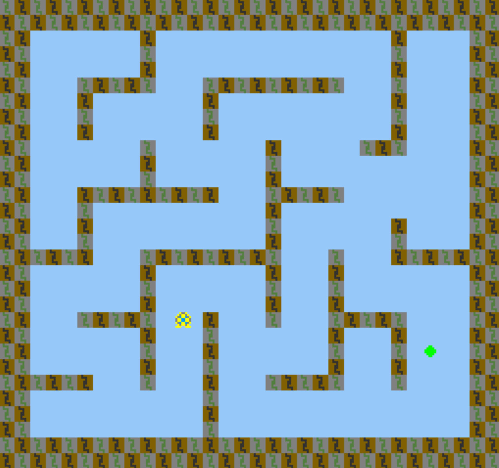

# Maze Teleportation

Author: David Lyons

Design: It's a maze, but the goal changes locations every few seconds. Can you get lucky enough to reach it?

Screen Shot:

How Your Asset Pipeline Works:

For my asset pipeline, since the PPU palette can only be 4 colors, I drew everything in black, red, blue, and green.
Black means transparent. Then red, blue, and green mean take the first, second, and third entries in the palette.
So for any tiles, I made an 8x8 grid of one of these four choices. Then rather than having to build palettes from images,
I make the palettes and images separately. For palettes, I made a 4x1 color line, starting with black transparent, and convert it.
Then in the constructor I load the pngs and have helper routines to convert these black/red/green/blue choices into palette
indices for the tiles. Then in the draw function, I simply grab a tile and palette.

How To Play:

Left, right, up, down. Anything sky blue can be moved through. The bricks (brown/gray and gray/green) cannot be
crossed. Touching the green goal will win the game. The goal will randomly change locations with a different seed
every game every 3 seconds, with the exception being that the first switch takes 5 seconds. Try to chase it down 
while navigating the maze. But beware! Don't just sit and wait for it to randomly come to you. If you take more
than 30 seconds to reach the goal, you lose!

This game was built with [NEST](NEST.md).

